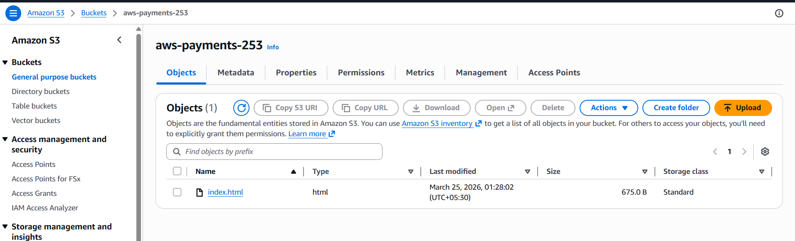
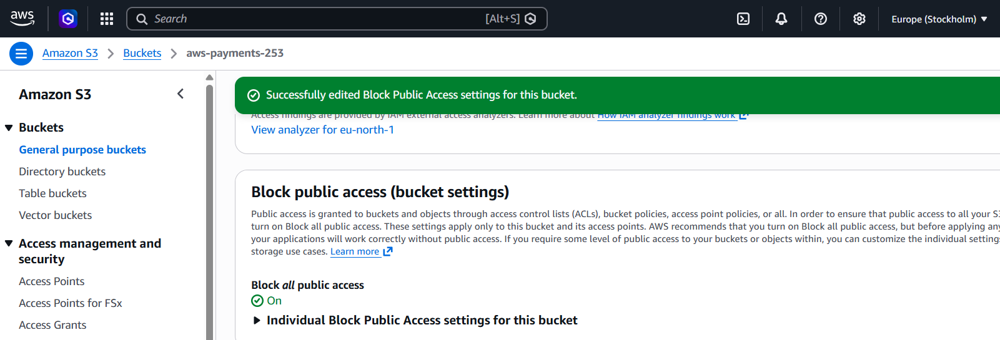

S3 access control demo using root user permissions
# S3 Access Control Demo

## Overview

This demo shows how S3 bucket access can be restricted and allowed only to authorized users.

## Steps performed

1. Created S3 bucket
2. Enabled block public access
3. Tested object URL access
4. Verified access denied
5. Checked root user permissions

## Screenshots

### Bucket created

### Block public access

### Access denied

### Root access

### Permissions tab

## Learning

- Public vs private bucket
- Root user permissions
- Access control in S3
- AWS security basics
