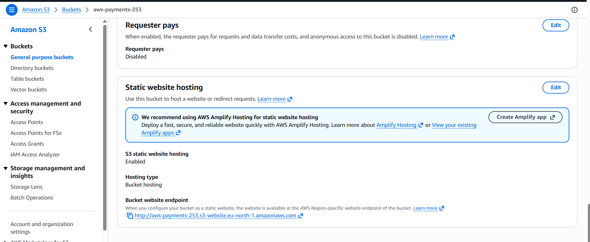
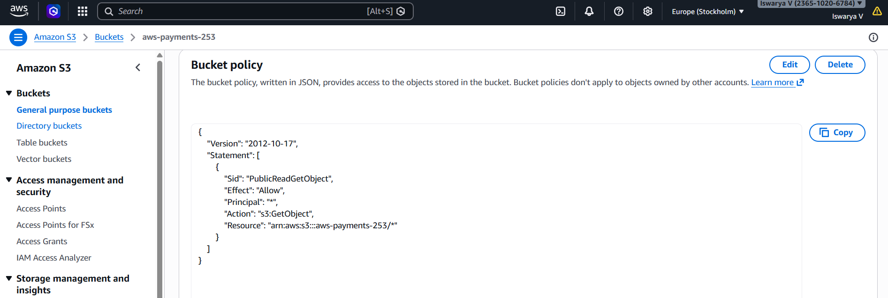
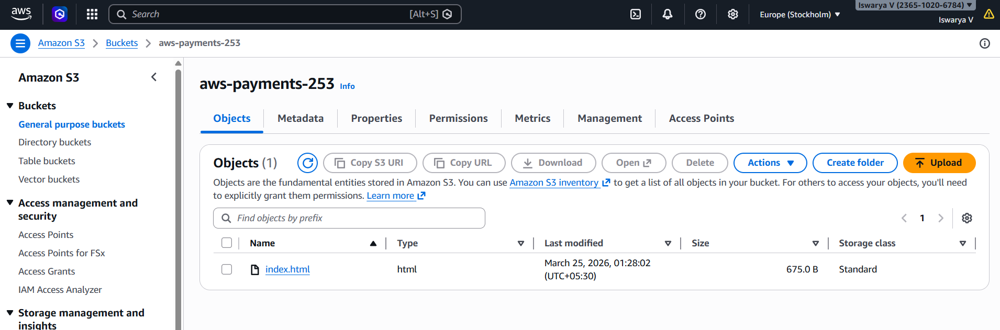
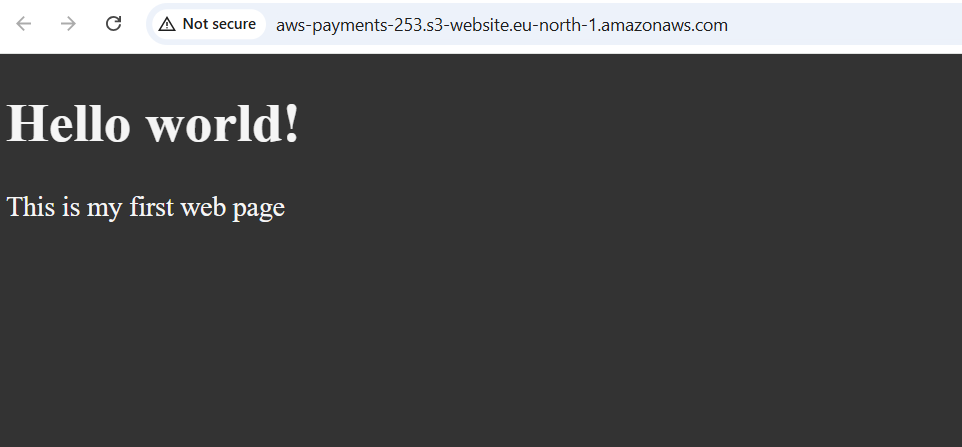

Static website hosting demo using AWS S3
# S3 Static Website Hosting

## Overview

This demo shows how to host a static website using AWS S3.

## Steps performed

1. Created S3 bucket
2. Disabled block public access
3. Enabled static website hosting
4. Uploaded index.html
5. Added bucket policy
6. Accessed website using S3 URL

## Screenshots

### Bucket created

### Static hosting enabled

### Bucket policy

### Files uploaded

### Website output

## Learning

- How S3 hosting works
- Public access settings
- Bucket policy basics
